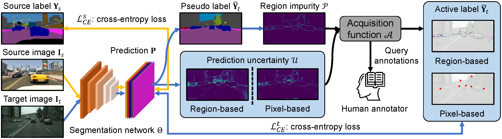

 ---

<div align="center">    
 
# Region Impurity and Prediction Uncertainty (CVPR Oral)

[Binhui Xie](https://binhuixie.github.io), [Longhui Yuan](https://scholar.google.com/citations?user=fVnEIZEAAAAJ&hl=en), [Shuang Li](https://shuangli.xyz), [Chi Harold Liu](https://scholar.google.com/citations?user=3IgFTEkAAAAJ&hl=en) and [Xinjing Cheng](https://scholar.google.com/citations?user=8QbRVCsAAAAJ&hl=en)


[](https://arxiv.org/abs/2111.12940)&nbsp;&nbsp;
[](https://drive.google.com/drive/folders/1GUGsMHnBHlk5rlkAsUq55O2GNdFF_--a)&nbsp;&nbsp;
[](https://www.bilibili.com/video/BV1oS4y1e7J5)&nbsp;&nbsp;
[](https://www.youtube.com/watch?v=kN4Kru2fL-g)&nbsp;&nbsp;
[](https://www.dropbox.com/s/mm14k36ydirk2w8/cvpr22_poster_2x1_in-person.pdf?dl=0)&nbsp;&nbsp;

</div>

This repository provides the official code for the paper [Towards Fewer Annotations: Active Learning via Region Impurity and Prediction Uncertainty for Domain Adaptive Semantic Segmentation](https://arxiv.org/abs/2111.12940).

🥳 We are happy to announce that RIPU was accepted at **CVPR 2022 Oral Presentation**.

## Overview
We propose a simple region-based active learning approach for semantic segmentation under a domain shift, aiming to automatically query a small partition of image regions to be labeled while maximizing segmentation performance. 
Our algorithm, RIPU, introduces a new acquisition strategy characterizing the spatial adjacency of image regions along with the prediction confidence. 
The proposed region-based selection strategy makes more efficient use of a limited budget than image-based or point-based counterparts. 



We show some qualitative examples from the Cityscapes validation set, 


and also visualize the queried regions to annotate.


For more information on RIPU, please check our **[Paper](https://arxiv.org/pdf/2111.12940.pdf)**.

## Usage
### Prerequisites
- Python 3.7
- Pytorch 1.7.1
- torchvision 0.8.2

Step-by-step installation

```bash
conda create --name ADASeg -y python=3.7
conda activate ADASeg

# this installs the right pip and dependencies for the fresh python
conda install -y ipython pip

# this installs required packages
pip install -r requirements.txt

```

### Data Preparation

- Download [The Cityscapes Dataset](https://www.cityscapes-dataset.com/), [The GTAV Dataset](https://download.visinf.tu-darmstadt.de/data/from_games/), and [The SYNTHIA Dataset](https://synthia-dataset.net/)

Symlink the required dataset

```bash
ln -s /path_to_cityscapes_dataset datasets/cityscapes
ln -s /path_to_gtav_dataset datasets/gtav
ln -s /path_to_synthia_dataset datasets/synthia
```

Generate the label static files for GTAV/SYNTHIA Datasets by running

```bash
python datasets/generate_gtav_label_info.py -d datasets/gtav -o datasets/gtav/
python datasets/generate_synthia_label_info.py -d datasets/synthia -o datasets/synthia/
```

The data folder should be structured as follows:

```
├── datasets/
│   ├── cityscapes/     
|   |   ├── gtFine/
|   |   ├── leftImg8bit/
│   ├── gtav/
|   |   ├── images/
|   |   ├── labels/
|   |   ├── gtav_label_info.p
│   └──	synthia
|   |   ├── RAND_CITYSCAPES/
|   |   ├── synthia_label_info.p
│   └──	
```

### Model Zoo
We have put our model checkpoints here [[Google Drive](https://drive.google.com/drive/folders/1GUGsMHnBHlk5rlkAsUq55O2GNdFF_--a?usp=sharing)] [[百度网盘](https://pan.baidu.com/s/17PovD8QfMzZiC5pyYzOqXA)] (提取码`RIPU`).

#### GTAV to Cityscapes
<table>
  <thead>
    <tr style="text-align: center;">
      <td></td>
      <td>name</td>
      <td>backbone</td>
      <td>budget</td>
      <td>mIoU</td>
     <td>ckpt</td>
    <td>where in <a href="https://arxiv.org/abs/2111.12940">Our Paper</a></td>
    </tr>
  </thead>
  <tbody>
    <tr>
      <td>1</td>
      <td>RIPU-PA</td>
      <td>V2</td>
      <td>40 px</td>
      <td>65.5</td>
      <td><a href="https://drive.google.com/drive/folders/1GUGsMHnBHlk5rlkAsUq55O2GNdFF_--a?usp=sharing">Google Drive</a>&nbsp/&nbsp<a href="https://pan.baidu.com/s/17PovD8QfMzZiC5pyYzOqXA">BaiDu</a>&nbsp</td>
      <td>Table 1</td>
    </tr>
    <tr>
      <td>2</td>
      <td>RIPU-RA</td>
      <td>V2</td>
      <td>2.2%</td>
      <td>69.6</td>
      <td><a href="https://drive.google.com/drive/folders/1GUGsMHnBHlk5rlkAsUq55O2GNdFF_--a?usp=sharing">Google Drive</a>&nbsp/&nbsp<a href="https://pan.baidu.com/s/17PovD8QfMzZiC5pyYzOqXA">BaiDu</a>&nbsp;</td>
      <td>Table 1</td>
    </tr>
    <tr>
      <td>3</td>
      <td>RIPU-RA</td>
      <td>V3+</td>
      <td>5.0%</td>
      <td>71.2</td>
      <td><a href="https://drive.google.com/drive/folders/1GUGsMHnBHlk5rlkAsUq55O2GNdFF_--a?usp=sharing">Google Drive</a>&nbsp/&nbsp<a href="https://pan.baidu.com/s/17PovD8QfMzZiC5pyYzOqXA">BaiDu</a>&nbsp;</td>
      <td>Table 1</td>
    </tr>
  </tbody>
</table>

#### SYNTHIA to Cityscapes
<table>
  <thead>
    <tr style="text-align: center;">
      <td></td>
      <td>name</td>
      <td>backbone</td>
      <td>budget</td>
    <td>mIoU</td>
      <td>ckpt</td>
      <td>where in <a href="https://arxiv.org/abs/2111.12940">Our Paper</a></td>
    </tr>
  </thead>
  <tbody>
    <tr>
      <td>1</td>
      <td>RIPU-PA</td>
      <td>V2</td>
      <td>40 px</td>
      <td>66.1</td>
      <td><a href="https://drive.google.com/drive/folders/1GUGsMHnBHlk5rlkAsUq55O2GNdFF_--a?usp=sharing">Google Drive</a>&nbsp/&nbsp<a href="https://pan.baidu.com/s/17PovD8QfMzZiC5pyYzOqXA">BaiDu</a>&nbsp</td>
      <td>Table 2</td>
    </tr>
    <tr>
      <td>2</td>
      <td>RIPU-RA</td>
      <td>V2</td>
      <td>2.2%</td>
      <td>70.1</td>
      <td><a href="https://drive.google.com/drive/folders/1GUGsMHnBHlk5rlkAsUq55O2GNdFF_--a?usp=sharing">Google Drive</a>&nbsp/&nbsp<a href="https://pan.baidu.com/s/17PovD8QfMzZiC5pyYzOqXA">BaiDu</a>&nbsp;</td>
      <td>Table 2</td>
    </tr>
    <tr>
      <td>3</td>
      <td>RIPU-RA</td>
      <td>V3+</td>
      <td>5.0%</td>
      <td>71.4</td>
      <td><a href="https://drive.google.com/drive/folders/1GUGsMHnBHlk5rlkAsUq55O2GNdFF_--a?usp=sharing">Google Drive</a>&nbsp/&nbsp<a href="https://pan.baidu.com/s/17PovD8QfMzZiC5pyYzOqXA">BaiDu</a>&nbsp;</td>
      <td>Table 2</td>
    </tr>
  </tbody>
</table>


#### Source-free scenarios
<table>
  <thead>
    <tr style="text-align: center;">
      <td></td>
      <td>task</td>
      <td>budget</td>
    <td>mIoU</td>
    <td>source pre-trained ckpt</td>
      <td>adapted ckpt</td>
      <td>Where in <a href="https://arxiv.org/abs/2111.12940">Our Paper</a></td>
    </tr>
  </thead>
  <tbody>
    <tr>
      <td>1</td>
      <td>GTAV to Cityscapes</td>
      <td>2.2%</td>
      <td>67.1</td>
    <td><a href="https://drive.google.com/file/d/1YimMmFE8yceCDori0l1TCR_aH_pigkzr/view?usp=sharing">Google Drive</a>&nbsp/&nbsp<a href="https://pan.baidu.com/s/1DkIupuggBs-_wg9j5xpc6Q">BaiDu</a>&nbsp</td>
      <td><a href="https://drive.google.com/file/d/1kjdO6vSqU5tzQnEuJave43qzgKX6nSez/view?usp=share_link">Google Drive</a>&nbsp/&nbsp<a href="https://pan.baidu.com/s/1VGch_pEgpukZpCEjQNSIlA">BaiDu</a>&nbsp</td>
      <td>Table 12</td>
    </tr>
    <tr>
      <td>2</td>
      <td>SYNTHIA to Cityscapes</td>
      <td>2.2%</td>
      <td>68.7</td>
<td><a href="https://drive.google.com/file/d/15otC9L6yCLjyYQl2Z_6Q4ORyq3T4AT5Z/view?usp=share_link">Google Drive</a>&nbsp/&nbsp<a href="https://pan.baidu.com/s/1zRAb2HttwlgerOyGz085Kg">BaiDu</a>&nbsp</td>
      <td><a href="https://drive.google.com/file/d/1URaXtXZ3wfT1bw54cJEI2qiVefTEpaTK/view?usp=share_link">Google Drive</a>&nbsp/&nbsp<a href="https://pan.baidu.com/s/1opjIZmZA1VeyNCH2IEsN-A">BaiDu</a>&nbsp;</td>
      <td>Table 13</td>
    </tr>
  </tbody>
</table>


### RIPU Training

We provide the training scripts in `scripts/` using a single GPU.

```bash
# training for GTAV to Cityscapes
sh gtav_to_cityscapes.sh

# training for SYNTHIA to Cityscapes
sh synthia_to_cityscapes.sh
```

### RIPU Testing
To evaluate RIPU e.g. [GTAV to Cityscapes (v3+, 5.0%)](https://drive.google.com/file/d/1_ZNbEw_hGh5cAX59vlIgRdfkFF7M5nCY/view?usp=sharing), use the following command:
```bash
python test.py -cfg configs/gtav/deeplabv3plus_r101_RA.yaml resume checkpint/v3plus_gtav_ra_5.0_precent/model_last.pth OUTPUT_DIR checkpint/v3plus_gtav_ra_5.0_precent
```


## Acknowledgements
This project is based on the following open-source projects: [FADA](https://github.com/JDAI-CV/FADA) and [SDCA](https://github.com/BIT-DA/SDCA). We thank their authors for making the source code publically available.


## Citation
If you find this project useful in your research, please consider citing:
```latex
@InProceedings{xie2022ripu,
    author    = {Xie, Binhui and Yuan, Longhui and Li, Shuang and Liu, Chi Harold and Cheng, Xinjing},
    title     = {Towards Fewer Annotations: Active Learning via Region Impurity and Prediction Uncertainty for Domain Adaptive Semantic Segmentation},
    booktitle = {Proceedings of the IEEE/CVF Conference on Computer Vision and Pattern Recognition (CVPR)},
    month     = {June},
    year      = {2022},
    pages     = {8068-8078}
}
```

## Contact

If you have any problem about our code, feel free to contact

- [binhuixie@bit.edu.cn](mailto:binhuixie@bit.edu.cn)

or describe your problem in Issues.
